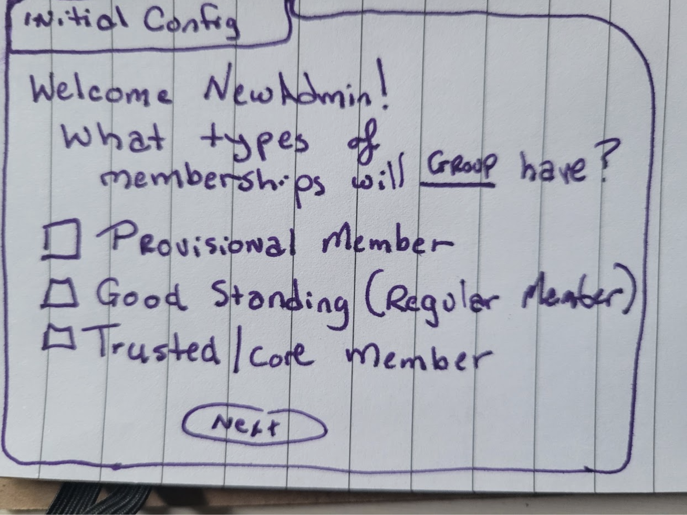

# Sideways Verifiable Community

# Specifications Document v 1.2 (active version)

Document history:

* v1.0 author Grace Rachmany, Sept 2024
* v1.1, Grace Rachmany, October 30 2024 
    * Integrating comments from the team on this document, plus Bernhard Frey’s initial comments ([commented document Kopie here](https://docs.google.com/document/d/1kGWEYuml9vaMx-CYfWSm8SlUFifaXGKpAV7oMJ-0CUI/edit)). 
    * Many comments were left in for further team discussion. partners
    * Decision was made to create a “White Paper” / Business Plan for outside consumption
 * v1.2 Grace Rachmany, July 1, 2025
    * Includes updates from Use Cases developed with team (Geoff Turk, Oli Sylvester-Bradley, Kaliya Young)
    * Moved from private repository to the public Sideways Repository
    * Added cute diagrams and sketchy mockups

# Executive Summary

Challenge: how to create trust in a decentralized system

Hypothesis: by having certifying entities that vouch for individuals, and take on group responsibility for the individuals’ behavior. Vouching entities can impose consequences on individuals and therefore can vouch for their good standing.

# Introduction: Verifiable Community

What is a network of networks and how do you know you belong to one?

Verifiable Credentials system allows people to prove their belonging to a particular group, and it allows groups to freely associate with one another. 

This specification is the result of more than 100 interviews and discussions with people coordinating or participating in “networks of networks”, coalitions, “ecosystems”, consortia, and other types of groups of groups. The main finding was that there is no tooling for networks to identify member organizations and members of member organizations. 

As a result, these organizations have no clear membranes and they trust one another only through long-term relationships. Furthermore, there is no real way to know whether an organization or individual adheres to the values they claim to espouse. People generally have to keep this information in their personal memories, and it leads to the inability for networks and movements to effectively collaborate and grow. 

Most organizations use some form of word of mouth, but a few use either blockchain-based identifiers, such as tokens or NFTs. Others use proprietary databases or paid memberships.

Problems cited by organizations:

* Difficulty in scaling = inability to do movement building to address planetary problems because identifying aligned partners is completely manual
* Leaders of organizations need to keep information “in their head” about which partner organizations and individuals are reliable (or not). 
    * Leaders burn out
    * Accountability always falls on a very small handful of people
    * Knowledge disappears either because of memory or transmission problems
* History of partnerships among organizations is lost, so each relationship needs to be restarted
* Wasted time assessing potential partner organizations which were already known to be inappropriate / unreliable
* Difficulty in addressing people who don’t adhere to code of conduct
* Immature or bad actors jumping from one community to another
* Grabbing and blabbing (information leaks, inappropriate behavior)
* Rugging and thugging (theft, collusion for antisocial outcomes)

## Verifiable Community

This proposal starts from the point of addressing the need for a commonly used “Extranational” digital identification to span across different types of emergent communities addressing the polycrisis. Furthermore, the solution is designed to be flexible enough to enable people who cannot attain national documents to have a reliable and unique identification document that can prove their eligibility for services provided by different NGOs and communities, as well as their rights to participate in governance or economic institutions relevant based on their eligibility.

This document is the result of research with leaders of groups of groups: consortia, networks-of-networks, umbrella organizations, etc. The Sideways team formally interviewed approximately 30 different organizers who had different approaches to networks-of-networks to  assess their needs. We also conducted dozens of informal discussions and interviews on the topic. It also incorporates research with the Self-Sovereign Identity community who have been working on these problems for decades, and who are well versed in the tradeoffs of different technologies as they may be applied to this problem space.[ The report is publicly available here](https://sideways.earth/neworkresearch/).

## Terminology

In this document, we use the word “**identification**” rather than identity. Identity can be many things. The system described in this documentation is a form of identification or certification that allows a person to prove they are who they say they are, and show something about the context in which they are making a request for access to services. (Similar to a driver’s license.)

**Vouching and certification **in this document refer to certifications that are validated by the group who issues them. Individuals could use the system to issue certifications, but the primary use is to create certificates that are “backed” by a group which attests the individual meets certain criteria. (Similar to a university degree.) 

**Issuers** are entities that provide credentials to individuals. **Verifiers** are entities that provide services. Often, groups will fill both roles, for example, if two villages have an agreement to host one another’s members. They both Issue credentials to their members and verify credentials from the other village. 

For context: While Sideways is mainly concerned with IRL human interactions and physical world resources, the solution is a digital solution and therefore can be used across both online and physical world contexts. 

## Challenges

**Societal challenge:** How can a global movement or alternative society know who is a member of the movement? Increased momentum around addressing the polycrisis makes it impossible to “keep up” with everything that is happening. As we create an alternative to the default way of living, resourcing the movement is, in great part, dependent on being able to identify one another in different contexts. For sharing of resourcing, hosting trusted partners, event participation, trusted transportation and supply chains, and conflict resolution, it’s key to identify who is part of the network, and what organization will be held accountable for an individual’s activity on behalf of that organization. (Examples are in the [Use Cases](#use-cases-10) section.)

**Human challenge:** A billion people today are unable to prove their identities for a variety of reasons (collapse of their government, non-person status in the eyes of the regime, etc.). Others may wish to opt out, for example, those joining “Network States”, either formally or informally. Article 6 of the Declaration of Human Rights states “Everyone has the right to recognition everywhere as a person before the law.” That right is completely independent of belonging to a nation. For a variety of reasons, people may wish to declare themselves a legal person, independent of a particular nationhood, and people have the right to do so. Yet, to date, no interoperable digital solution is available. One of the basic requirements for implementation of commons-based approaches, as outlined by by the P2P Foundation, is to have clear “membranes” to recognize membership of aligned organizations. (Different attempts in the Web3 space tend not to be interoperable, similar to other existing types of organizational memberships. Similarly, the UN has used digital identifiers for refugees, but these identities are typically used for exclusion rather than inclusion, such as denying right-to-movement across borders for refugees.)

**Organizational Challenge:** How can an organization maintain and evolve cultural norms and ensure that members continue to represent those cultural norms consistently? The approach taken in this paper sees the organization as the basic unit of human functioning, and allows each organization to maintain its own standards. An organization is any group of 3 or more people operating under a recognizable name. A network or ecosystem is a collaboration among multiple groups. 

## Mathematicians of the Empire

The use cases described in this document are already happening. From Indigenous tribes to the Climate Majority to Silicon Valley billionaires, individuals and groups are declaring their dissociation from the institutions of nation-state and corporate capture. They are declaring independence in different ways, and fragmenting into different types of sub-cultures and bubbles of society.

The Mathematicians in Isaac Asimov’s Foundation series cannot prevent the coming turmoil as the Galactic Empire is crumbling, but they can reduce the period of turmoil and chaos from 30,000 years to 1,000 years if they can tap into the collective knowledge of humanity.

Digital infrastructure, such as that described in this document, is our approach to trying to minimize the era of turmoil by connecting the projects that are driving towards addressing the polycrisis and developing new forms of collective societies. 

Many people have chosen alternative lifestyles through communities such as Ecovillages, Cooperatives, Network States, Sharing Economies, Community Currencies, Cryptocurrencies, DAOs, Anarchist Collectives, Free Trade Zones, Micronations, and other formations. However, today, those communities connect with one another through the existing systems. They use their mobile phone apps and maps, financial rails, and official borders to connect. If their nation imposes a sanction against another nation, they are blocked from connecting with their aligned communities in significant ways. 

Sideways are the ways that we are developing to allow values-aligned or trust-related communities to recognize one another and create a parallel system. Inside of creating these alternative systems is the need for privacy and trust that members will not be exposed for belonging to a system that “competes” with militarily powerful entities. The first piece is the simple ability to identify someone as officially belonging to one of those communities, in a way that all of the communities agree upon. On top of this basic identification system, it is possible to build new values systems that are not beholden to the current institutions. It will take time, perhaps even a few generations. 

Digital identity crept up on us. Digital identity wasn’t even a thing 30 years ago. Now, we can redesign digital identification, taking into account the lessons learned. Fortunately, most of the necessary technology is already available, much as Open Source free software. The main requirement is for people to free their minds and recognize that their identity is theirs alone. 

No government can assign you personhood. No protocol can assign you personhood. Your humanity and personhood exist independent of these entities. You are free to declare your associations. At first, as these systems are nascent, most people will have parallel identities in the default system as well as identities in these new systems. Over time, at different paces, different people and communities will choose to live more of their lives in alternative systems. We are attempting to make that possible through fundamental infrastructure that most of us take for granted. Without such infrastructure, we remain fragmented liferafts. With such infrastructure we can create flotillas and eventually islands of coherence.

## Design assumptions

Verifiable Community allows people to prove their belonging to a particular group, and it allows groups to freely associate with one another. 

* **Alternatives to the current economy and governance systems must have protected membranes. **(Ostrom’s principles 1 and 7). The right to assembly and association allow people and groups to opt out of the existing system, but they can only do so if there are mechanisms for defining the boundaries of the organizations and networks. If your network requires government-issued identification or government-issued money, your dependency on the existing system will prevent you from scaling alternative economic or governance models. 
* **Group certification is game-theoretically different from aggregated individual vouches. **[(In fact, cooperative game theory is a distinct discipline.)](https://www.sciencedirect.com/topics/computer-science/cooperative-game-theory)** **Individuals experience high costs of giving another person a negative rating, and significant benefits from giving a better rating than the person deserves, particularly when the recipient has power of any kind. Group certification is the opposite. A “brand” or group certification loses all of its value if it is not backed by a real guarantee of some kind.
* **Group representation is game-theoretically different from individual behavior. **People act differently depending on the entity they represent, and they behave differently when they know their behavior will affect an entire group (even a group as small as their family). 
* **Decentralization as a foundation:** The system described should allow for a non-hierarchical network infrastructure with no single point of control or failure. Although this document describes an “app”, in fact, the app is the outward expression of an underlying interoperable protocol that would allow any organization to create its own app and communicate with any other organization that is using the underlying protocol. 

# Use cases

All use cases are group-based use cases. The logic for using a group as the basic unit of operation is described in the Background section ([here](#group-rather-than-individual-22)). 

Identification is a two-sided market. There are those who issue credentials and those who accept credentials. Government authorities issue driver’s licenses. Rental car companies and police officers accept driver’s licenses. The use cases, and this document in general uses the terminology Issuer and Validator because it is common in the digital identity community as a whole. 

## Issuers

Groups issue identification in the form of “Good Standing” certificates for members. Good standing means different things to different groups, and that’s fine. Each group publishes the standards for members to maintain the Good Standing certificates. If they do not honor their own standards for certificate issuance, the certificate will lose value (e.g. a Harvard degree isn’t what it used to be). Individuals may hold multiple certificates if they are in good standing with multiple groups.

### Nuncastian association

The Nuncastian are an oppressed minority in their homeland. Both in their homeland and abroad, they are denied legal identity documents. The Nuncastians have a traditional structure of community elders, as well as their own language, culture, and spiritual practice. The elders want to issue Nuncastian identities to their members abroad who have left to escape oppression or for better futures. If a Nuncastian adopts certain foreign habits or harms another person, the elders may revoke their membership, in accordance with Nuncastian traditions.

Nuncastians abroad help one another with integration to new places. They would like to collaborate with refugee communities with compatible cultural practices, but they can only identify their own members, not those of other cultures. 

### Ecology extreme

Ecology Extreme organizes people to take civil disobedience actions that have direct impact on the environment. Actions range from causing logging equipment to accidentally fall into the river to saving heritage seeds and planting farms with non-GMO seeds in regions where national governments have ceded power to multinational corporations. 

The organization wants to be able to issue a membership credential, first of all, to protect those members who are in trouble with their own governments for such actions. In some cases, members are indigenous people who might not have the right to identity from the government, or who don’t want to accept the government’s sovereignty over their personhood. In other cases, the activists are under persecution for environmental action and wish to be able to move around and access services provided by like-minded organizations and people. Secondly, Ecological Extreme wants to ensure that people are not acting in ways that are too extreme, for example, where people might be harmed, or if they were offered shelter by a sister organization and were not considerate of the hosts. Thirdly, EE wants to cooperate with other organizations who sometimes need participants who are willing to take higher risks than those partner organizations can take. The partners need to be able to identify members who are “safe” to talk to about risky actions.

### Scitopiana

Scitopiana is a Network State committed to the betterment of humans through technological augmentation. Many Scitopianians no longer wish to be associated with their nation of origin, either because of the tax affordances of Scitopiana, or because of ethical considerations. While they use passports from nation-states for travel, they would like an independent identification they can use among different Network States. Scitopiana has relations with other Network States and also recognizes Nuncastians and other populations that might not be recognized by the default nation-state system. Scitopiana believes any human has the right to self-identify and they are entering into different types of commercial and political travel arrangements with other Network States. Having a digital identification document for their citizens allows them to operate businesses, maintain self-sovereign control of their medical records, and participate in the country’s crypto-based financial services sector. 

### Hippeati Commune

The Hippeati Commune is a regenerative village of 80 families living in harmony with nature. Hippeati is part of a network of intentional communities that provide different ways of living to their members. Members can move among villages when their life circumstances change, for travel and vacations, or for knowledge exchange. The intentional community network uses identification authentication for different levels of access depending on the relationships among different intentional communities. Hippeati also may offer space to Ecology Extremists or Nuncastians, regardless of their legal status. They maintain commercial agreements with Scitopia but do not allow Scitopians (or other genetically altered creatures) on their territory.

## Verifiers / Validators

Verifiers provide services. Each Verifier determines what certificates they will accept and under what terms they will interact with those who hold certificates. Individuals have the ability to show or hide whatever certificates they chose. The initial system specification shows direct relationships between Issuers and Verifiers, but as the system grows, intermediaries (Registries) will be needed for different levels of assessment of credentials.

### Heath4Alll

Health4All is a non-profit organization operating health clinics for underserved people, regardless of their affiliations and nationalities. They use a portable digital health record system to allow patients to carry their Electronic Health Record (EMR) with them as they travel. Health4All provides services to digital nomads, refugees, and other uninsured people, based on a sliding pay scale. They recognized the identifications from all of the organizations above. For Nuncastians, they provide free or minimally priced services. For Ecology Extreme members, they provide services for those who are in danger of being accosted by legal authorities if they self-identify at government health agencies. Most Hippiopiansa are covered by their national health services, but they often come to offer emotional or alternative healing services at Health4All. For Scientopians, Health4All offers international health insurance programs, ZK-EMR services, and a variety of confidential services for recovering Biohackers who have tried too many experimental procedures.

### Baskata

Baskata is a collective of people with nationality in a Spanish-speaking country, but whose culture dates back prior to national rule. Baskatans have a number of locations in their indigenous territories where they are restoring historic villages. Baskatans have space to accept digital nomads, refugees, and other “unwanted” peoples into their communities, as long as they have good standing in their own communities and are willing to work on the restoration of these villages and learn the language of the locality. 

### Ecolrner

Ecolrner is a loosely associated group of alternative education and “homeschooling” locations, organized by parents who prefer not to send their children to nation-sponsored schools, or who are unable to because they are not recognized by the nation in which they live. Ecolrnr is resourced as a commons. For example, teachers may live in an intentional community and have their needs taken care of, rather than being paid in monetary terms, or the teachers may just be homeschooling parents who share teaching days among themselves rather than hire teachers. Different Ecolrnr locations have different policies about who to accept to the collective based on their identification, needs and abilities. Some Ecolrnr locations are recognized by the national authorities, and others prefer to go under the radar. 

### ChickenBus

ChickenBus is a collective of drivers with their own vehicles, providing transportation services that may or may not comply with national and international standards. ChickenBus provides a variety of other types of local and trans-national transport services to those who belong to different groups in the network. They provide free school bus services to Nuncastians children going to Ecolrn. ChickenBus requires documents of good standing for transportation of refugees and other unwanteds, to protect their collective from being reported to the authorities. 

### ChickenBus Scientific

ChickenBus has an elite transport service (ChickenBus Scientific) which may or may not be involved in transporting certain types of minerals, chemicals, and biohacking essentials to Scitopiana, as well as “natural pharmaceuticals” to Hippeati. They also are able to transport low-cost pharmaceuticals from India and China to Health4All worldwide locations.

## Intermediaries / registries

Medium to large-scale credentialing systems require intermediaries, typically in the form of registries. A registry is a list of trusted credentialing authorities. For the initial iteration of this system, we imagine direct issuer-to-validator relations, but the architecture will provide for the addition of registries or other types of intermediaries.

Real life examples of intermediaries and registries:

* List of accredited universities
* Organic growers association
* EPA-registered laboratories for EnergyStar ratings

Another approach to intermediaries is using machine-generated algorithms to provide a reputation score. The Ethereum Attestation Service founders have suggested that this approach will be used for the credentials issued on their service. That approach is less common and is more typical in closed systems. 

Real life examples of reputation scores:

* Credit ratings
* Gitcoin Passport
* Online reviews (Amazon, Google, Uber, Upwork)

In all of the above cases, the algorithm of the score is somewhat opaque, and it is possible for any of those entities to weigh the scores to benefit themselves. For example, Uber might observe that people give lower ratings if their skin color doesn’t match the skin color of the driver, and they might compensate for that in their algorithm. We aren’t saying that happens, we are just saying we have no way of knowing. To implement such a system, "someone" would need to be the authority on how to weigh ratings. Deciding on "no weight" creates bias. 

Because of the need for value judgements by centralized authorities, we have decided **NOT** to implement ratings or scores. Instead, the Registry system allows for validation and a decentralized and transparent architecture. Below are use cases for the registries for our system.

### De-nation coalition

The de-nation coalition encourages people to take back their freedom. The de-nation affiliation is an anonymous group of cyberpunks who help organizations implement software to take back their privacy and autonomy. De-nation provides a service to validate credentials and publishes the following registry lists:

* De-nation stars: Network states, free cities, and other place-based communities which have passport-like credentials and enforce ecological and social codes of conduct on their citizens.
* De-nation basic: Place-based communities that enforce social or legal codes of conduct on their citizens (in other words, you can trust a member not to be a criminal). 
* De-nation eco: Any group or community that issues credentials that enforce on members ecological and basic ethical behavior.
* De-nation resource: Communities that provide regular resources to others in the ecosystem. This could be a hackerspace, food farm, server farm, hospitality location, or other community. The community must enforce basic codes of conduct so the members are trusted for their honesty. 

De-nation coalition accepts applications for issuers who want to be on the registries with a sliding scale for applications depending on the number of members and the paying capacity of the organization. They also maintain an online complaint process so that if there are multiple verified complaints against members of a listed organization, they may be removed from the registries. De-nation also has a conflict resolution body, so that those complaints can potentially be resolved for a fee that covers conflict resolution costs.

### Earth Huggers Unite

Earth Huggers Unite (EHU) is a coalition providing a registry of organizations such as Ecology Extreme (above) who issue credentials to members of climate activism, regenerative, and environmental organizations. To get on the EHU list, an organization needs referrals from other organizations. Once an organization is accepted, they need to also volunteer as part of EHU to investigate and approve of other applications to the EHU list. To get on the EHU registry, the membership requirements must involve at least 100 hours per year of activism or contribution to the members organization, adherence to a code of conduct, and integrity in dealings with other organizations.

## Network state: Access to physical world resources

**Problem background**

* Steeve is a member of GigaLandDAO. Onchain, Steeve has 3 wallets (1 on ETH, 1 on Polygon, 1 on Solana) with which she has been putting assets to GigaLandDAO treasury and participated in voting.
* GigaLandDAO owns 3 locations with houses/beds, etc. to which members have access: 1 in Boston, 1 in London, 1 in Hanoi
* Steeve physically shows up in Hanoi and wants access to that house

**Problem**

* How do the people in Hanoi know that "Meatbag Steeve" is the owner of the 3 famed wallets?

**Answer**

* They ask Steeve to transfer a minimal amount of tokens to the DAOTreasury [or sign something, if they're more advanced :) ] right now

**Issues with this process**

* Having a wallet doesn’t MEAN anything. It doesn’t prove that Steeve won’t destroy property, leak information, or rug other people. 
* Steeve has to do this each time she goes to a GigaLandDAO location
    * Steeve is doxxed each time, which might make her uncomfortable
    * The process might quite a bit of time, especially if all wallets are to be verified (e.g. to calculate Steeve’s amount of status tokens across all wallets)
* No one with the right permissions might be there; the verification has to be scheduled in advance
* Steeve has to show up with (physical) access to her private keys (e.g. hardware wallets), which might become a physical security concern if that became more broadly known (e.g. robberies)

**Alternative solution**

* GigaLandDAO would like to issue an ID to Steeve once, which she could use at each property/event, etc. of GigaLandDAO
* Furthermore, that same ID should be valid at other network states and/or events

## Network state: Membership and access to partners

Problem background

* GigaLand is a Special Economic Zone with two physical locations. To be a good-standing member of GigaLand, they have established the following membership criteria: 
    * Clean criminal record in country of origin
    * Payment of citizenship fee
    * Business with at least 3 months of cash flow equivalient to the value of 1 oz/gold per month  \
OR purchase of residence worth at least 40 ounces of gold  \
OR residency in GigaLand for a minimum of 1 year
    * Zero compliants about business or personal misbehavior, or clean settlement of any complaints through the GigaLand Justice League 
* GigaLand has established bilateral visitation and business agreements with MegaLand and ByteLand. Visiting businesspeople get up to 7 days free in one anothers’ Co-working and hotel facilities.
* Steeve has passed all membership criteria by running a business in GigaLand for more than a year. 
* When Steeve visits MegaLand, he is able to automatically access the co-working and reserve a free hotel room for the nights he visits.

Problem

* How does MegaLand know that Steeve won’t mug, rug, thug, or rug during their vist? 

**Answer**

* GigaLand’s Verifiable Credential proves that Steeve is trusted. Megaland can out how long he has held the membership. If anything goes wrong, Steeve knows their membership can be revoked and GigaLand could revoke their business license as well. MegaLand knows that this vouch means that MegaLand will provide mutual services and compensate them if there is a problem.
* GigaLandDAO would like to issue an ID to Steeve once, which she could use at each property/event, etc. of GigaLandDAO

Furthermore, that same ID should be valid at other network states and/or events

# Background

## Identification basics

For those who are unfamiliar with identity technology, this section explains the different components of a technical solution and why they should be separate components. As users of reputation and identity solutions, most people never notice these distinctions.

For a system that is decentralized and useful across different applications, separating the components is important. For example, the most common identification issuer is the government. Have you ever gone through the fast-track security lane or noticed that there are barely any checks of your identification in some countries? It’s seamless because many separate processes are bunched together and controlled by one entity. 

The system outlined in this document separates these processes so that the control is in the hands of the actual person who holds the identification information. In this system, no one entity could take away a person’s identification information. 

On the first level, it’s easy to imagine this system as an app like the pay application on your mobile phone. 

Your app has the details of your bank or credit card. The shop has a point of sale system which knows how to read the credit card, and you approve the purchase. In this system, we would say the bank is the “Issuer” and the shop is a “Verifier”. You are the person in control of the interaction. You could choose a different credit card, for example. Notice also that the Verifier, the shop, can decide that they take cash only. The Verifier has the “access” that you want, and they ultimately can decide what types of money are good at their shop.

An example closer to the identification system described here is the one below, where you get a university degree.

The university issues the degree, let’s say it’s an architecture certification. When you apply for the job, you show the degree. The employer decides whether they trust the certification for that job. Already you can see there are two components the Verifier is considering: the type of degree and the quality of the university. The university (Issuer) needs to maintain its reputation for the degree to be worth having. This is why you can say something like “A Harvard degree doesn’t mean what it used to mean.” 

Once you understand this architecture, you can see it anywhere you show any type of credential. When you rent a car, the rental company decides whether your driving license is valid enough. You are in control of what document you pull out. You might have multiple degrees or more than one driver’s license. The car rental company only gets to see what you show.

You might notice that there’s another entity in many of these cases, and we call that entity the Registry. For academic institutions, there are entities (usually government ministries) which issue a list of “Accredited” universities. Similarly, governments may determine the authorized list of insurance companies. 

It’s not always a government, for example, the International Shotokan Karate Federation (ISKF) gives a list of official dojos, so if you get a belt (another type of certification), and it is from one of the dojos on the list, that is a valid belt in that particular discipline. 

The Verifier might know the Issuer, or they might not. The Verifier has to meet the qualifications to be on the Registry, and the Verifier can look at the registry to find out if the Issuer is a good one. Nobody gets to look at what I have in my hands unless I show it to them. 

When it comes to “control” or “decentralization”, it is obvious that there can be any number of issuers. There are plenty of educational institutions that are not accredited (like the dojos). Anyone can create their own class and issue a certificate. Anyone can ask you to show a certificate. What is less obvious today is that the Registry can be decentralized. In the Karate example, it's decentralized because there are lots of "schools". I’m sure someone knows the difference between Shidokan and Shokotan and Karate-Do, and I’m sure they are very important distinctions even though they mean nothing to me. 

This might seem like a trivial example, but you can see how it applies to different certificates in an Verifiable Community system. Actually, you might already feel that the University Accreditation system is flawed and wish there were some other reliable source to know whether a degree is representative of a good education.  Different Network States, DAOs, and NGOs could be Issuers of identification certificates. They could also be Verifiers, and there could be many other Verifiers. Each Network State would have a different Registry they refer to when deciding what other certificates to accept. It's obvious that the Ecovillage Network and the Special Economic Zone networks feel very differently about what it means to be a "good" member organization, so they would each have their own Registries.

## Group rather than individual

Case for group as the basic unit of operation: Our hypothesis is that it is only through “groups of belonging” that humanity can pull through the existing crisis. Vouching on an individual-to-individual basis carries too little risk to the person vouching, and too little enforcement. Groups are able to maintain standards and codes of conduct, guide or rehabilitate those who breach standards, and exclude those who violate the culture of the group. People can freely choose to belong to groups (or not), and anyone can form a group that maintains a culture. A family is a group that maintains a particular culture. 

## What about reputation?

The credentialing system described in this document could potentially be used for more nuanced reputational certifications. Going back to the dojo example, a dojo could issue digital certificates equivalent to “belts”. Someone could hold a green or purple or red belt from their Karate dojo. In the DAO space, different types of reputation scores are being worked with. Hats provides role-based certificates, Gitcoin provides a “passport” score, and others are working on different ways of more nuanced vouching systems. 

Despite our sense that reputation is a key primitive that can be used to replace some aspects of the monetary system, our research has convinced us that a simplified “Good Standing” system is the most practical approach to reputation for several reasons:

* The complexity of reputation issuance and interpretation needs to be adapted for so many different use cases that it is impossible to generalize. We often say “We didn’t get the Semantic Web, but we did get flight aggregators.” In other words, systems and organizations that need reputation scores for specific applications need to create their own measurement and aggregation techniques. Today, almost all of the online reputation systems are closed (think AirBnB or Uber). 
* Even with the very best reputation score possible, it’s still impossible to know whether people or organizations will “vibe” or “gel” or “like” working together. The human part can’t be eliminated. The system described in this document is a gatekeeping system that can create some kind of web of connections based on shared values, but it doesn’t substitute for other systems or relationship building.
* We are biased towards creating systems that will maintain behaviors and enforce codes of conduct, rather than creating reputation systems. We believe that reputation is too malleable given conditions where an individual or organization could “take advantage” of a situation. Similarly, organizations and individuals can repair damage instead of carrying a long-term reputational blemish. 
* In reality, people only give fully truthful reputation information in intimate and highly relevant situations. The cost of public criticism of others is high, as is the benefit of public praise. In extremely private situations, people say what they really think. Any other reputational data is partial at best. 
* An open reputation system is highly problematic from a privacy standpoint. It may be possible to overcome this problem at some point, but now is not that moment.

In some ways, collecting lots of badges and credentials gives rough reputational information, and it might be the best that can be done in an open system. 

## Legality, morality, and ethics

The Verifiable Community system is being designed with positive evolution in mind. We want it to be used by social change activists, ecological and regenerative communities, and for humane causes. At the same time, some regimes in the world feel threatened by activist movements. As a colleague once commented “one man’s terrorist is another man’s freedom fighter”. 

In other words, legal is not the same as ethical  or moral. When we are faced with a choice, it is our duty as human beings to make the ethical choice. Fortunately, under international law, we can base our activities on foundational documents such as the Universal Declaration of Human Rights (USDHR) as well as the Universal Declaration of Indigenous Rights and the Rights of Nature (which we expect will be adopted by the UN within the next few years).

The Verifiable Community can be used for any type of membership card, and it provides a quality of interoperable identification that previously could only be provided by governments or large corporations. 

We believe that groups of values-aligned people have the right to live according to their values as long as they do no harm to others

We don’t believe we have the right to impose our ethics or morality on others.

Therefore, we are creating technologies in collaboration with social and environmental activists, knowing that any club or community could use this same technology. We are creating technologies that are ethically agnostic, because we do not have a monopoly on ethics. 

The examples in our [Use Cases](#use-cases-10) section represent a variety of different values, not all of which we share. Yet, we believe that humanity’s survival depends on the great variety of different cultures, religions, and values that form complementary opposites that bring harmony and homeostasis to our habitation on earth. Therefore, we trust in humanity to use these systems in a way that may seem dysfunctional in some areas, but which is overall necessary for the blossoming of different cultures.

# The Verifiable Community app: User flows

## Design considerations

* Assumption that users are non-technical: all user interfaces must be super easy to use.
* Interoperability: anyone can develop an app based on open protocols.
* Initial defaults are simply the boundaries of the application, but the protocol can support significant expansion. 
* Privacy-preserving by default.
* Decentralized at each level (multiple independent organizations can provide the same services). 
* Freedom for organizations to determine their own values and code of conduct, and to define “good standing” as they see fit.

## Defaults

* No immutable or public records: no blockchain-based VCs or attestations. The protocol will support blockchain-based VCs as long as they adhere to the standards, but the app by default allows issuers to revoke, individuals to delete, and is fully privacy-preserving.
* Individuals hold their own credentials and have the right to expose or hide whatever credentials they hold. The system will provide safe and encrypted ways for people to back up their credentials without relying on us as a custodian. 
* No central database whatsoever. Each issuer can hold their own database, or decide not to have a database, but there is no need for this system to hold any credentials, because each person holds their own. 

## Issuer: Defining credentials and issuance requirements

By default, Issuers are offered 3 types of credentials: Membership (In good standing), Trusted Membership, and Provisionary membership. Credentials can be permanent, time-bound, or revocable. To define a credential, the administrator creates the credential, name, and image, and writes a text-based list of what it means to hold such a credential. They then issue rules on who can issue the credential.

* User: Administrator, or pre-configured with Sideways when onboarding the organization. Organizations should be able to define capabilities for administrators that require X of N permissions and multiple equal admins (decentralized organization capabilities). 

Examples (from [Use cases](#use-cases-10)) of the type of issuance and the issuance requirements:

* Nuncastian association offers an official Nuncastian membership to individuals born into the Nuncastian tribes. Any one of the 38 recognized Nuncastian Priests can issue the revocable certificate. Revocation can happen if someone adopts a foreign religion or violates certain precepts of Nuncastian culture, and revocation requires 3 Priests to approve it.
* Ecology Extreme issues Provisional Membership to anyone who participates in any of their civil disobedience actions. At each action, there is an on-site coordinator who provides a list of the public key identifiers of participants. Full EE Membership is issued to the core team, coordinators, and anyone who has been arrested or is deemed to be in danger based on their actions. However, EE also maintains a blacklist of individuals who are banned from membership of any kind. This includes anyone who has taken violent actions against living beings, violated the code of conduct against other EE members, or who has leaked secret information. There is a team of 40 authorized administrators who can upload lists of activists to the system for membership approval. At least 3 of the administrators must approve a list before membership is approved for those individuals on the list. EE also issues a Top-Secret credential which is not listed publicly, however a few of their anarchist partners know about this secret credential and honor it accordingly. 
* Hippiati Commune issues a certificate of contribution to anyone who has volunteered for more than 3 months and had no issues of misconduct, a provisional membership certificate to people who have lived in the commune for 1 year, and full membership to full members, who typically are accepted after 3 years. Provisional membership is also sometimes used if someone is on probation because of misconduct that doesn’t warrant expulsion. Senior council members must unanimously approve any issuance or revocation of membership. The Volunteer coordinator can approve certificates of contribution with the approval of one senior council member.

Note: The Verifiable Community protocol is agnostic to how organizations keep their own records. Member organizations might use real or fake names, use Google Docs for their members list, have a secret list or a public blockchain list, or use a piece of paper. It is not the business of the Verifiable Community protocol to dictate how any organization runs itself. The Validators and Registries might care about those things and provide access based on how they perceive another organization, but again, that is not the business of the Verifiable Community protocol. We just provide a communications network upon which aligned organizations can identify members of their partner organizations.

## Issuer: Issuing certificates

Issuers have defined the rules that are required for approvals. Anyone who is authorized to approve someone for membership can enter the name of the person into the system to initiate the process as well as provide the first approval for the member or members they add. The system will also allow uploading of a list file for bulk approval.

After adding the new member or performing a bulk upload, the person will either approve issuance of the certificate, decline, or abstain. It is possible that someone will have the job of uploading membership requests but not approve all of them. For example, if someone uploads a list of applicants for membership, but they can only vouch for the ones they know, they may not be in a position to give final approval for the certification.

Where more than one approval is needed to issue a certificate, approvers are sent periodic email notifications to approve new members, and they can log on to the app to see their list of members to approve. For example in the example we gave above for Ecology Extreme, three administrators are needed for activists to achieve good standing.

In systems where an objective criteria needs to be met (for example, in a DAO where someone needs to work a certain amount of time or hold an NFT), the app will have an API which allows for automation of the process.

## Registry: creating and publishing registries

In the first phase of the issuance of the Verifiable Communitys, there will be a closed group of groups issuing and recognizing each others’ certificates. At the same time, all of the work will be open source so that others can create interoperable certificates. Once the proof of concept is complete, the system, apps, and standards will be opened up to any group. 

During the initial trials, probably up to approximately 100 groups, it will be manageable for groups to maintain their own registries of what certificates they accept on what basis. 

Conceptually, we expect the registries to be simple lists, something like json files, that are able to be used by the validators of the certificates in the apps they will use for their own purposes.

## Validators: accepting and validating certificates

Acceptance and validation of certificates will be possible on a customizable basis. The initial implementation will have a simple interface where an organization can create a list of the certificates they accept, or use a registry of the certificates they accept. When an individual wants to claim a privilege given by a validator, they will validate themselves either digitally with their public key, or in person using a QR or NFC code.

The process will be as follows:

1. An individual who wants a service and has the credentials to claim the service makes a request. 
2. The Validator with the service to provide sends a digital request for verifiable credentials relevant for the service. The individual gets a notification saying what request was sent and what credentials qualify them for services.
3. If the user approves sending the credentials, they are sent either in a Zero-Knowledge or open way to the Validator, and the Validator’s approves the person’s request.

Services could be online services, such as access to gated content, or in-person services, such as entrance to a physical hacker house. 

# Technical specifications

## Design considerations

>Open rant
>
>It drives us crazy to hear government officials talk about how they “assign” people identities and how there are people who don’t have identities because a government authority didn’t give them an identity. Identity isn’t assigned. It’s just there. If your government disappears tomorrow, you aren’t going to evaporate suddenly. Last names didn’t even exist until a thousand years ago, when English Barons decided it would be easier to collect taxes from people if they could list them all. 
>
>It frightens us that there are entities who can “erase” your online identity in different ways. De-platforming and shadow banning are new concepts that convey the inordinate power held by commercial entities to impact people’s social lives and livelihoods. Governments, too, are designing digital identities which give the bureaucracy the technical ability to revoke digital identity capabilities, rendering people unable to receive basic services. This happens **everywhere**. In Europe today, more than 300,000 people are stateless. Many are targeted ethnic minorities, but many are stateless because of corruption or incompetence. To the individual, it doesn't matter why their identity has been stripped from them. The effects are the same. 
>
>Close rant

The Verifiable Community puts identity where it belongs: in the hands of the individual holding credentials, and at the discretion of the issuer to vouch for any individual that the issuer wants to vouch for. With that in mind, the following design considerations inform the technical specifications:

* Privacy: Credentials must be encrypted and private to every individual. Issuance of the identity is a private transaction between the issuer and the individual receiving the credential. Credentials should never be stored on a public ledger. 
* Self-custodianship: Ability for every individual to hold their own credentials and store them wherever they want. Custodial services may become a third-party offering, but as a default, the system does not store any credentials. While the issuing entities can revoke a particular credential, there is no entity which can impinge on the person’s ability to continue to carry the credentials they have earned. Credentials should be able to be transferable from one app to another based on user preference.
* Non-competition: The Verifiable Community system does not compete with other identification systems such as those offered by governments, institutions, or corporations. 
* Open standards: For ease of use, the Verifiable Community service will offer a front-end application to issuers and verifiers, but the standards will be open so that any app developer can create an interoperable application. Where possible (for example, for registries), the system will rely on third parties to create apps to serve functions that are not core to the business. 
* Decentralization: At each level of implementation, the system will offer the ability for multiple “authorities”, with no centralizing function. Any entity can define “good standing”. Any entity can decide what credentials to accept. Any entity can issue a registry of valid credentials. Individuals and entities can decide how to store and when to display credentials. The only centralized function is the protocol itself. The protocol will continue to be defined and developed by the users of the Verifiable Community, and it is the intention of the founders to provide a DAO-like structure for participation of all members in the decisions that affect the protocol.
* Sovereignty and value-agnosticism: Individuals can use their credentials as they like. Issuers can issue and revoke credentials as they like. Validators can accept credentials as they like and use whatever registries align with their own values. Each entity is sovereign. All entities can offer paid or free services.

## 1. As a group member I want to: {#1-as-a-group-member-i-want-to}

### Receive my first VC (download wallet app)

1. Members receive an email or link that they have a new VC and they are prompted to download the wallet app if they haven't already.
2. When they download the app, they are prompted to: 
    1. Choose their user name and profile picture.
    2. Record or write down a 24-word seed phrase and then retype it on a new screen to confirm they recorded it.
    3. Confirm that they are 100% responsible for keeping an encrypted backup of app metadata that can be restored by the app. They are advised to have multiple backups. Options could include:
        1. Hard drive backup
        2. Cloud drive backup
        3. Multiple app instances (on computer and on phone)
        4. Local phone backup
    4. The participant proves they have a backup that can be restored with the authentication method and user name chosen. 
3. The initial VC is then added to the app.
    5. How this is done depends on whether the action is online or offline. The admins must somehow generate and give unique tokens to members so they can register a public key with the group's server.
    6. The app sends the public key and the group server generates a VC for that key and sends it back to the user's wallet (the app).

### Receive additional VCs

1. Members receive an email or link that they have a new VC.
2. Members can accept or reject the VC.
3. If they accept the VC, it is added to their wallet app.

### Apply for a VC or ask the admins I know to approve my VC membership {#apply-for-a-vc-or-ask-the-admins-i-know-to-approve-my-vc-membership}

For the initial release of the app, requesting membership cannot be done within the app because the app cannot list all of the memberships available in the network. Over time, it may be able to interface with registries or have some other way of allowing people to find organizations.

1. If a member did not receive a VC and they think they should get membership, they can make a request outside of the app for membership or membership upgrades if they know the email of an administrator for that organization.
2. The admin logs that request in the system with a note about why they should be added (or not).
3. All pending requests are shown in the weekly notification email sent to all admins, until it is either accepted or rejected by the other admins. Rejections must include a reason.
4. If it is rejected, the participant is notified outside of the app along with the reasons for rejection.
5. If a participant has made 3 requests for membership within 6 months and been rejected each time, they cannot keep making requests to that organization (offline process).

### Display my VCs to someone who asks for them (selective disclosure) {#display-my-vcs-to-someone-who-asks-for-them-selective-disclosure}

1. In the app, members see a searchable list of all their credentials. 
2. They then select the credentials to display or transmit to the requesting Verifier.
3. The Verifier receives the credentials and validates them. This could be initiated with a QR code when the VC holder and verifier are in the same physical space (or even over a video call) or online with a unique link or or code that can be pasted into a form.

### Save a backup of my credentials in a safe way {#save-a-backup-of-my-credentials-in-a-safe-way}

1. During the initial setup or at any time, the member is prompted to keep a backup of their credentials.
2. The backup is saved as an encrypted file for safety.
3. The member can save to a hard drive (external or internal), IPFS (decentralized storage) or to a cloud provider.

Future versions should have an automatic encrypted backup option for users so they don’t have to worry about storing the app metadata themselves.

### Access my credentials from another device (restore credentials) {#access-my-credentials-from-another-device-restore-credentials}

Members should be able to restore their credentials on another device using their secure seed phrase and the encrypted backup of their wallet app data.

## 2. As a group multi-sig admin I want to: {#2-as-a-group-multi-sig-admin-i-want-to}

### Configure the system for the types of memberships available {#configure-the-system-for-the-types-of-memberships-available}

The initial configuration of the app will be done in coordination with the group team. The team will indicate the members of the core team (trusted members) who will all be issued “Trusted Member” VCs as they are added. 

The team will agree upon the *m* of *n* requirements for approving the VC definitions. All initial administrators will automatically have a Trusted Member VC as well as an admin login.

1. After login, the initial configurator sees the definition of Trusted Member the 3 levels of VCs they can define (Provisional Member, Member in Good Standing, Trusted Member). They choose the member status they want to define.

2. The admin adds an image (optional) and a description (required) of the meaning of the VC. 

3. The admin adds the requirements for approving that type of VC. If the admin allows specific members to approve or nominate other members, those members will also have admin privileges to invite and accept new members.
4. The admin repeats this process for all 3 VCs (optional). At least one VC needs to be defined, but it is not required to have all 3 levels. Future versions will allow organizations to define custom VCs.

The VC definitions must be approved based on the requirements initially for *m* of *n*, so the list of VC types is sent to all other admins for approval based on the initial requirements.

### Add new members {#add-new-members}

1. The Add New Members screen allows administrators to:
    1. Upload a CSV of members to add
    2. Manually add new members
2. All fields are optional except for Username
    3. Username
    4. Name
    5. Email address
    6. Link (this can be used for anything (such as LinkedIn profile, membership application form, whatever the admins want)
    7. Text field (can be used for anything)
3. If the users are uploaded from a file, the admin reviews the file and can delete users before approving the list.
4. After uploading or adding, the admin clicks “Add” to approve the addition.
5. A notification shows saying the approval is pending (X) additional administrators, if relevant.

### Approve members that were added by other members

1. Admins receive daily notifications if there are members they need to approve (or members who should have credentials revoked or upgraded).
2. On the approval page, the admin sees a list of the members for approval (or revocation/upgrade/downgrade), with the username, email, and other information about the members to be approved/modified.
3. Admins can check multiple or all members, or approve individual members one by one.
4. If an admin rejects a request, they can add a note as to why they have rejected the application. That rejection notification is added to the table seen by other admins (with attribution) and can be marked so it can be seen by the member if they are rejected. If the application receives the quorum number of rejections before admins reach quorum for approval, the membership is rejected. The rejection reasons approved by the admins can be seen, without attribution, by the individual who is rejected for membership. 
5. If an admin approves a member who does not have emails, they are given the prompt to send a link to the member. 

### Notify member of their VC  {#notify-member-of-their-vc}

1. Once a membership or membership upgrade is approved, if the member has an email in the system, they receive an email. They will receive a reminder every 7 days until they claim or reject the VC. (They have the right to reject a VC).
2. For members who are approved but do not have an email, the Admins receive a weekly notification that there are uncollected VCs from people who don’t have email. Ideally that should be sent to the admin who initially added the person, because presumably they have some other way of contacting them.
3. When the admin logs in, they see the list of members who do not have emails and have not claimed their VC. They can “copy link” and send it to the member via any electronic method they want.

### Revoke membership, upgrade or downgrade (from provisional to full member, for example) {#revoke-membership-upgrade-or-downgrade-from-provisional-to-full-member-for-example}

1. The procedure for revocation is the same as for adding a new member, including the approvals process. When revoking a membership, there must be a reason stated by the admin making the initial request.
2. The procedure for notification is the same as for approvals
3. If someone is upgraded, their previous VC does not need to be revoked.
4. If someone is downgraded, their VC must be revoked.

## 3. As a verifier I want to:

### Check that someone has appropriate access to the resource in physical space. {#check-that-someone-has-appropriate-access-to-the-resource-in-physical-space}

1. The participant steps up to the physical location and scans or taps their app (either with an attendant holding another app on their phone or a hardware device).
2. The app shows the participant which of the credentials are valid for access to the location and lets them know whether a ZK proof or the actual certificate will be shown. Other conditions might be shown, for example, how long the permission is granted. One VC might give you 1 hour of parking but the other VC gives you 3 hours.
3. The participant chooses the VC or VCs they want to use to access the privilege. For some services you might need multiple VCs. 
4. The service is unlocked (gate opens, bicycle is freed from its lock, etc.)

### Check that someone has appropriate access to the resource in a digital commons. {#check-that-someone-has-appropriate-access-to-the-resource-in-a-digital-commons}

1. The participant logs in with their wallet DID (no exposure of VCs). 
2. The app shows the participant which of the credentials are valid for and lets them know whether a ZK proof or the actual certificate will be shown. The Verifier can display different conditions, for example, they might be explicit about the fact that you get different or better content with more VCs, or they might not.
3. The participant chooses the VC or VCs they want to use to access the privilege. 
4. The service is unlocked. In the case of the digital service, you don’t see all the “gates”. A web service could show completely different content based on the VC you show. 

### Future: Provide a customized output or access based on the permissions shown in the wallet. (For example, a map with locations that accept the credentials held/chosen by the member.)

1. The participant logs in with their wallet DID (no exposure of VCs). 
2. The app asks the participant which VCs are relevant to the content they are looking for at this time.
3. The participant chooses the VC or VCs they want to use to access the privilege. 
4. The output given by the service is customized based on the permissions and preferences shown by the certificates. 

# Potential risks and potential mitigations

* Exclusionary rather than inclusionion based
* Breaches: double-agents, spies, etc.
* Morally sketchy uses
* Revocation for political or personal reasons

# Business model

Sideways is a not-for-profit entity providing Civtech for a variety of organizations. The Verifiable Community is a core technology for communities worldwide. Income sources will be:

* Deployment and configuration of the EI technology for organizations that want to use it for their members.
* Service (software support and upgrades) for the applications provided.
* Consulting and implementation services.
* Marketplace and partnership services.
* Protocol grants and systems change grants.
* Contributions from users of the protocol who want to contribute (Open Source model).
* Registry marketplace,
